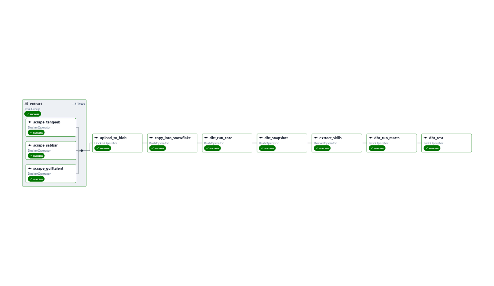
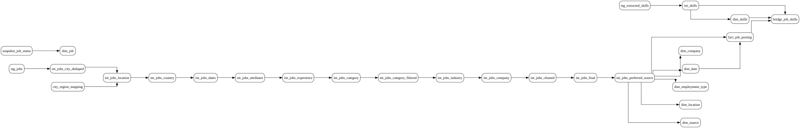

# JobPulse 🇸🇦

## Saudi Job Market Data Engineering Pipeline

JobPulse is an end-to-end **data engineering project** that collects job listings from Saudi Arabian recruitment platforms, processes and standardizes the data, tracks job status changes, extracts job skills, and delivers analytics through a Power BI dashboard.

The pipeline follows a **Medallion-style architecture** using Azure Blob Storage, Snowflake, dbt, and Apache Airflow.

```text
Job Platforms
     │
     ▼
Python Scrapers
     │
     ▼
Azure Blob Storage (Bronze)
     │
     ▼
Snowflake (Raw)
     │
     ▼
dbt (Silver)
     │
     ▼
dbt (Gold)
     │
     ▼
Power BI

Orchestrated by Apache Airflow
```

---

# 🏗️ Architecture

JobPulse is organized into three main data layers:

```text
                         DATA SOURCES
               ┌───────────┼───────────┐
               │           │           │
            Sabbar      Tanqeeb    GulfTalent
               │           │           │
               └───────────┼───────────┘
                           ▼
                ┌─────────────────────┐
                │   Python Scrapers   │
                │      Dockerized     │
                └──────────┬──────────┘
                           │
                           ▼
                ┌─────────────────────┐
                │ Azure Blob Storage  │
                │       BRONZE        │
                └──────────┬──────────┘
                           │
                           ▼
                ┌─────────────────────┐
                │   Snowflake RAW     │
                └──────────┬──────────┘
                           │
                           ▼
                ┌─────────────────────┐
                │      dbt SILVER     │
                │ Staging / Transform │
                │ Snapshot / Tests    │
                └──────────┬──────────┘
                           │
                           ▼
                ┌─────────────────────┐
                │      dbt GOLD       │
                │     Star Schema     │
                └──────────┬──────────┘
                           │
                           ▼
                     ┌──────────┐
                     │ Power BI │
                     └──────────┘
```

The complete workflow is orchestrated by an **Apache Airflow DAG** running in Docker.

---

# 🔄 Pipeline & Data Lineage

JobPulse provides two complementary views of the pipeline:

* **Airflow DAG** — shows task execution and orchestration dependencies.
* **dbt Lineage** — shows dependencies between transformation models.

## Airflow Orchestration

The workflow is orchestrated by the `jobpulse_pipeline` DAG.



The scraper tasks run in parallel using an Airflow `TaskGroup`, followed by warehouse loading, dbt transformations, snapshotting, skill extraction, mart creation, and testing.

## dbt Data Lineage

The dbt lineage shows dependencies between the models used to transform raw data into analytics-ready Gold models.



---

# 🎯 Project Objectives

JobPulse was built to demonstrate a complete data engineering workflow:

* Collect job listings from **Sabbar, Tanqeeb, and GulfTalent**.
* Run containerized Python web scrapers.
* Preserve raw scraped data in Azure Blob Storage.
* Load raw data into Snowflake.
* Clean, standardize, and validate job attributes using dbt.
* Handle real-world data quality issues and cross-source duplicates.
* Track job status changes using **dbt snapshots**.
* Build a tested **star schema** in the Gold layer.
* Extract job skills from job descriptions using an NLP component.
* Orchestrate the pipeline with **Apache Airflow**.
* Provide analytics-ready data for Power BI.

---

# 🥉 Bronze — Azure Blob Storage

The Bronze layer stores scraped files **as collected**, without transformation.

Data is partitioned by source platform:

```text
bronze/
├── platform=sabbar/
│   └── 2026-09-26_....csv
├── platform=tanqeeb/
│   └── 2026-09-26_....csv
└── platform=gulftalent/
    └── 2026-09-26_....csv
```

This layer preserves the original extracted data and provides a historical landing area before warehouse transformations.

---

# 🥈 Silver — dbt

The Silver layer contains the main data-quality and transformation logic.

Instead of implementing all transformations in one large model, the pipeline uses multiple **single-responsibility dbt models**.

| Model                       | Responsibility                                                                |
| --------------------------- | ----------------------------------------------------------------------------- |
| `stg_jobs`                  | Type casting, renaming, and basic filtering                                   |
| `int_jobs_city_deduped`     | Resolves city from source URLs and handles city-level duplicates              |
| `int_jobs_location`         | Normalizes city and region using a maintained seed                            |
| `int_jobs_country`          | Normalizes country and filters to Saudi Arabia                                |
| `int_jobs_dates`            | Converts free-text posting dates into real dates                              |
| `int_jobs_attributes`       | Normalizes employment, workplace, status, and source attributes               |
| `int_jobs_experience`       | Parses experience ranges into structured values                               |
| `int_jobs_category`         | Cleans job categories                                                         |
| `int_jobs_industry`         | Cleans industry information                                                   |
| `int_jobs_company`          | Validates and standardizes company information                                |
| `int_jobs_cleaned`          | Consolidates cleaned data before key generation                               |
| `int_jobs_final`            | Generates `job_key` and prepares incremental data                             |
| `int_jobs_preferred_source` | Selects the canonical row when the same job appears through multiple channels |

## City & Region Mapping

A maintained dbt seed:

```text
seeds/city_region_mapping.csv
```

is used to normalize city and region values.

This replaced manually maintained `CASE WHEN` statements and makes the mapping easier to maintain and test.

## Job Status History

The dbt snapshot:

```text
snapshot_job_status
```

tracks changes to `normalized_job_status`.

For example:

```text
Active → Closed → Expired
```

This preserves historical status changes rather than keeping only the latest value.

---

# 🥇 Gold — Snowflake Star Schema

The Gold layer provides analytics-ready data using a **star schema**.

```text
                    dim_date
                       │
                       │
dim_company ─────── fact_job_posting ─────── dim_location
                       │
                       │
                  dim_source
                       │
                       │
              dim_employment_type
                       │
                       ▼
                bridge_job_skills
                       │
                       ▼
                   dim_skills
```

### Main Tables

* `fact_job_posting`
* `dim_job`
* `dim_company`
* `dim_location`
* `dim_source`
* `dim_employment_type`
* `dim_date`
* `dim_skills`
* `bridge_job_skills`

Surrogate keys are generated using:

```text
dbt_utils.generate_surrogate_key
```

Referential integrity is validated using dbt `relationships` tests.

---

# 🤖 Skill Extraction

JobPulse includes a separate NLP component for extracting skills from job descriptions.

```text
Snowflake Job Descriptions
            │
            ▼
       jobpulse-nlp
   PyTorch + Transformers
            │
            ▼
    RAW.EXTRACTED_SKILLS
            │
            ▼
       dbt Gold Models
            │
            ├── dim_skills
            └── bridge_job_skills
```

The NLP component is containerized separately and executed as an Airflow task after the core transformation layer.

---

# 🔄 Airflow Pipeline

The Airflow DAG is named:

```text
jobpulse_pipeline
```

The main execution flow is:

```text
             ┌─ scrape_sabbar ────┐
             │                    │
             ├─ scrape_tanqeeb ───┼──► upload_to_blob
             │                    │
             └─ scrape_gulftalent ┘
                                      │
                                      ▼
                              copy_into_snowflake
                                      │
                                      ▼
                                dbt_run_core
                                      │
                                      ▼
                                dbt_snapshot
                                      │
                                      ▼
                               extract_skills
                                      │
                                      ▼
                                dbt_run_marts
                                      │
                                      ▼
                                  dbt_test
```

The three scraper tasks run in parallel using an Airflow `TaskGroup`.

The DAG is scheduled to run **daily**.

---

# 🧪 Data Quality

One of the main goals of JobPulse was to handle **real-world data quality problems** rather than assuming clean source data.

## 1. Deduplication

`source_job_id` was not sufficient as a unique identifier.

For example, Sabbar could reuse the same `source_job_id` for a posting associated with multiple cities.

The deduplication logic therefore considers:

```text
(source_job_id, job_url)
```

rather than `source_job_id` alone.

## 2. Source vs. Collection Channel

The project separates:

```text
normalized_job_source
```

from:

```text
job_source_channel
```

`normalized_job_source` represents the original platform associated with the job.

`job_source_channel` represents how the posting reached the pipeline, such as:

```text
Direct
Aggregated via Sabbar
Aggregated via Tanqeeb
```

This preserves information about both the original source and collection path.

## 3. Job Status History

`dim_job` uses the dbt snapshot to maintain the current status while preserving historical changes.

During development, an issue was discovered when `dbt snapshot` was missing from the Airflow workflow. This resulted in stale dimension records and orphaned foreign keys, which were detected through dbt `relationships` tests.

The pipeline was updated to explicitly run:

```text
dbt_snapshot
```

before building the Gold marts.

## 4. Data Quality Testing

The project currently runs **63 dbt tests**, including:

* `not_null`
* `unique`
* `accepted_values`
* `relationships`

The test suite runs as the final validation stage of the Airflow pipeline.

---

# 📊 Power BI Dashboard

Power BI connects to the Snowflake Gold layer using **Import mode**.

The dashboard provides analysis of:

* Total job postings
* Jobs by city and region
* Employment type
* Workplace type
* Experience requirements
* Source platforms
* Collection channels
* Extracted skills
* Job posting trends over time

---

# 🛠️ Technology Stack

| Area             | Technologies                                                     |
| ---------------- | ---------------------------------------------------------------- |
| Data Collection  | Python, Requests, BeautifulSoup                                  |
| Containerization | Docker, Docker Compose                                           |
| Cloud Storage    | Azure Blob Storage, Azure AD Service Principal, `azure-identity` |
| Data Warehouse   | Snowflake                                                        |
| Transformation   | dbt-core, dbt-snowflake, dbt snapshots, dbt seeds, dbt tests     |
| Orchestration    | Apache Airflow 3.12, DockerOperator                              |
| Skill Extraction | PyTorch, Hugging Face Transformers                               |
| Visualization    | Microsoft Power BI                                               |
| Development      | Git, GitHub, PowerShell, Windows                                 |

---

# 📂 Project Structure

```text
JobPulse-Data-Engineering-Project/
│
├── README.md
│
├── assets/
│   ├── dashboard/
│   │   ├── jobpulse_dashboard.pbix
│   │   ├── overview.png
│   │   ├── job_market.png
│   │   ├── skills.png
│   │   └── companies.png
│   │
│   ├── airflow/
│   │   └── jobpulse_pipeline-graph.png
│   │
│   └── dbt/
│       └── jobpulse_lineage.svg
│
├── airflow/
│   ├── docker-compose.yaml
│   ├── Dockerfile
│   ├── .env
│   └── dags/
│       └── Jobpulse_pipeline_dag.py
│
├── dbt/
│   └── jobpulse_dbt/
│       ├── dbt_project.yml
│       ├── seeds/
│       │   └── city_region_mapping.csv
│       ├── macros/
│       │   └── load_raw_files.sql
│       ├── models/
│       │   ├── staging/
│       │   │   └── stg_jobs.sql
│       │   ├── intermediate/
│       │   │   └── int_jobs_*.sql
│       │   └── marts/
│       │       ├── dim_*.sql
│       │       ├── fact_job_posting.sql
│       │       ├── bridge_job_skills.sql
│       │       └── schema.yml
│       │
│       └── snapshots/
│           └── snapshot_job_status.sql
│
├── src/
│   ├── scraper/
│   │   ├── Dockerfile
│   │   ├── sabbar_scraper.py
│   │   ├── tanqeeb_scraper.py
│   │   ├── gulftalent_scraper.py
│   │   └── upload_to_blob.py
│   │
│   └── nlp/
│       ├── Dockerfile
│       ├── requirements.txt
│       └── extract_skills.py
│
└── data/
    └── (Docker-managed scraper volume)
```

---

# 🚀 Getting Started

## 1. Clone the Repository

```bash
git clone https://github.com/fay-alnefaie/JobPulse-Data-Engineering-Project.git

cd JobPulse-Data-Engineering-Project
```

## 2. Build the Images

```bash
cd src/scraper
docker build -t jobpulse-scraper:latest .

cd ../nlp
docker build -t jobpulse-nlp:latest .

cd ../../airflow
docker-compose build
```

## 3. Configure Airflow

Airflow platform configuration is stored in:

```text
airflow/.env
```

Pipeline secrets are stored separately as **Airflow Variables** and accessed at runtime by the DAG.

Sensitive values are never committed to Git.

## 4. Start the Pipeline

```bash
cd airflow
docker-compose up -d
```

Open:

```text
http://localhost:8080
```

Configure the required Airflow Variables, enable the DAG, and trigger the pipeline.

---

# 👥 Team

### JobPulse — Data Engineering Team 4

* Fay Al-Nefaie
* Sumayah Dhafer
* Zainab Malik
* Jana Jamal

---

# ⚠️ Disclaimer

This project was developed for educational and data engineering purposes.

Data collection is performed in accordance with the terms, policies, and technical restrictions of the source websites.
